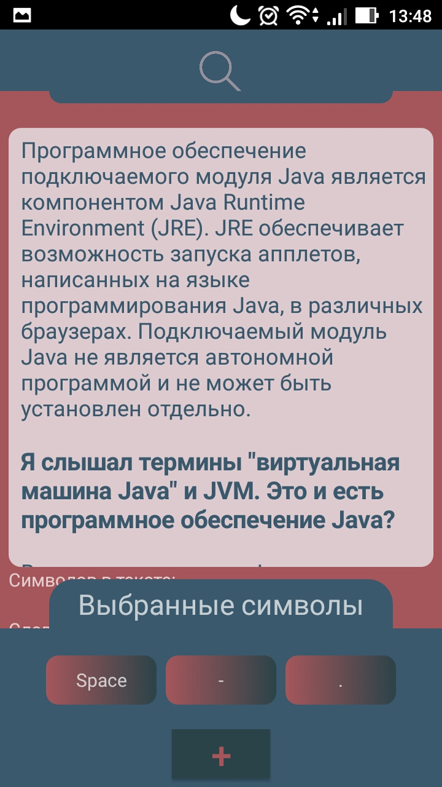
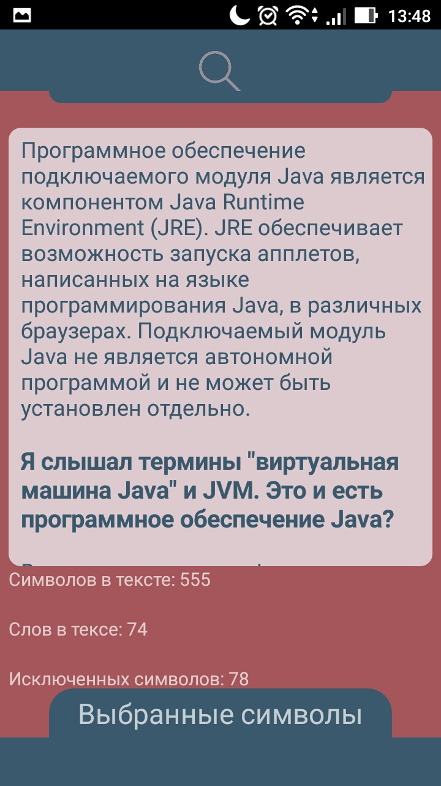
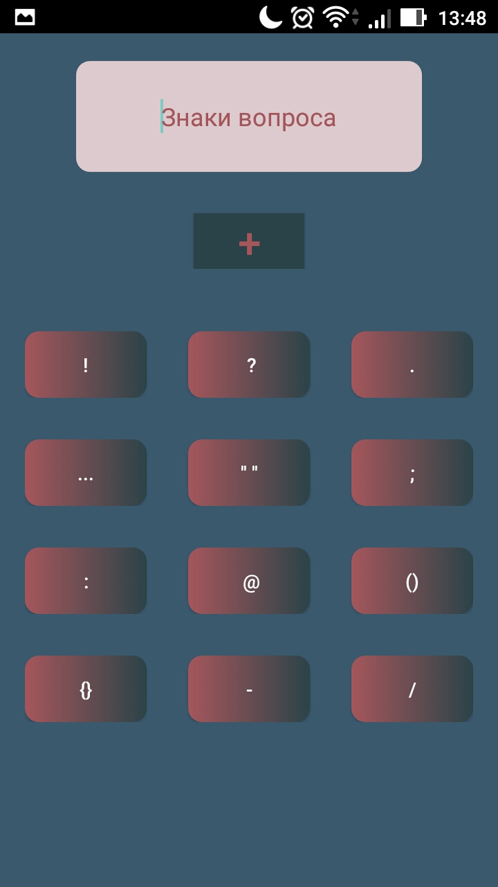

# CheckTheSymbols
Приложение ведет подсчет символов и слов в веденном тексте. 
Цель при разработке была поработать с алгоритмами, а также попробовать себя в работе с анимацией,без каких либо библиотек.

Класс NavBarAnim работа с анимацией и отлавливание свайпов вверх/вниз

В проекте 2 созданных пакета 
1.Пакет symbol_functional 
Класс Counter: Отвечает за подсчет символов и содержит в себе 4 метода:
	
getNumberExSymbol. Принимает текст и разбивает его в массив типа char, и введет подсчет символов которые были указаны пользователем и помещены в массив пришедший вторым аргументом. 
Вызывает методы  getNumberPoint и  getNumberEllipsis для подсчета точек и многоточий. 

getNumberPoint. В классе Validating есть поля типа boolean,заведенные для того,чтобы небыло конфликтов с точками и многоточиями.
Происходит проверка на точки, если выбраны то считаем их.

getNumberEllipsis. Аналогично getNumberPoint. 

getNumberWords.Отвечает подсчет слов. 

Класс Symbol. Отвечает за добавление символов в нужном виде. 

2 Пакет controller. 
Класс OnSwipeListener. Отвечает за отлавливание свайпов и запуск анимаций. 
Класс SymbolDeletion. Отвечает за удаление символов. 
Класс Validating.Отвечает за проверку на повторящие символы и преобразование символов.Содержит поля для проверки состояний. 

